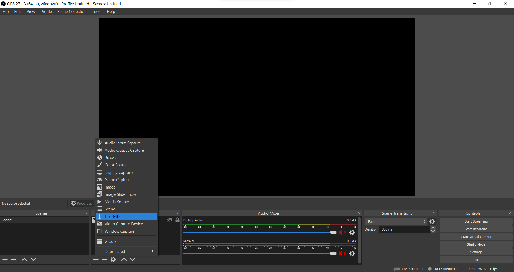
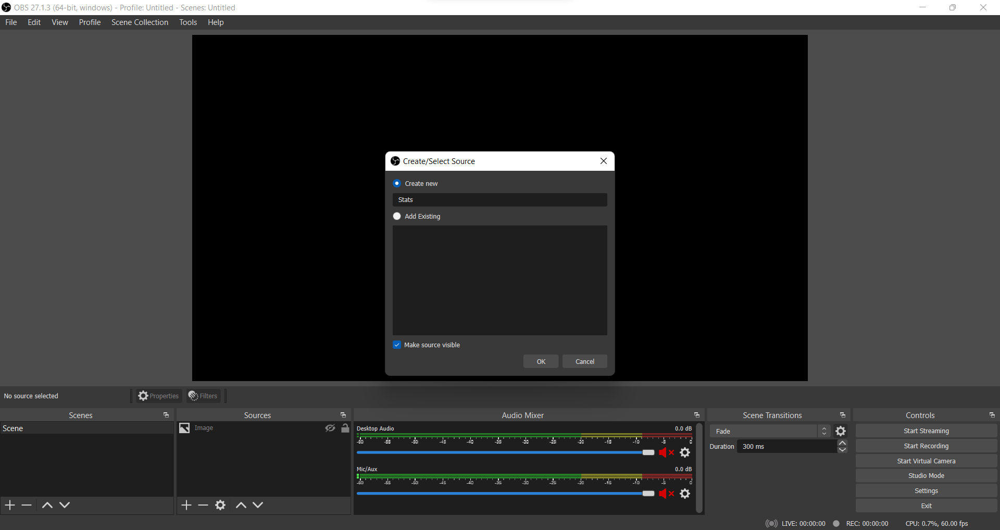
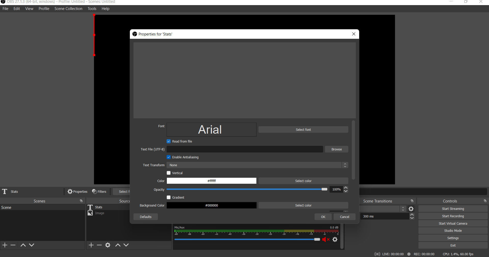
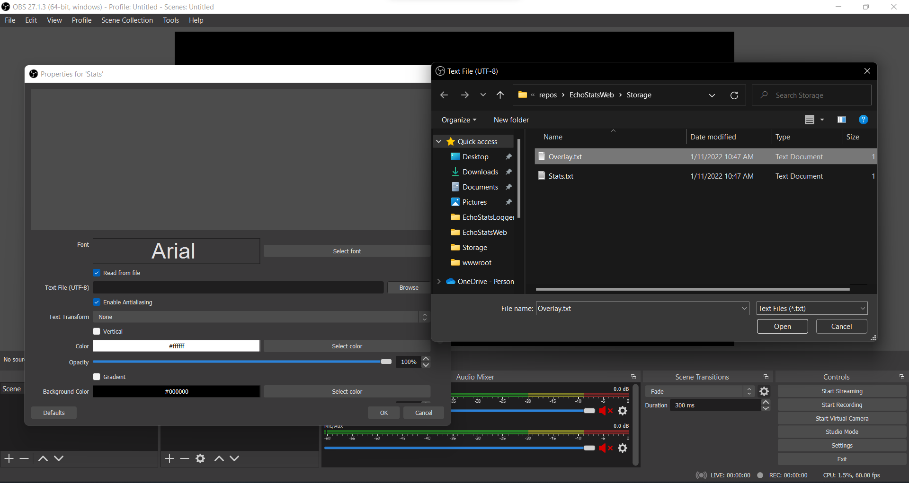
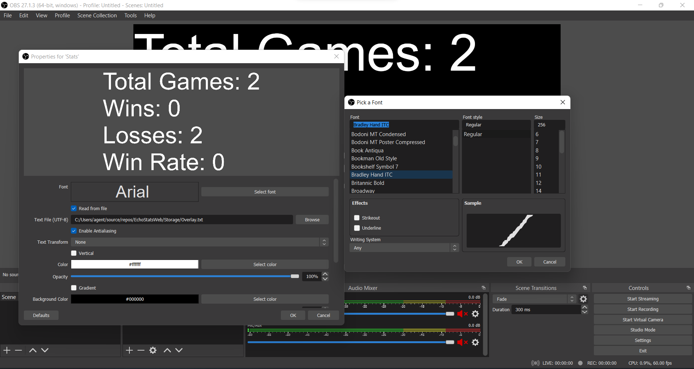

 ## OBS Usage
 **1.** Add a Text source.
 
 
 
 
 **2.** Give it a name, and click `OK`.
 
  
  
  
  **3.** Check `Read from file`.
  
   
   
   
   **4.** Click browse, and navigate to where your overlay files are. Select `Overlay.txt`, `Stats.txt` or `Daily.txt`.
   
   
   
   
   **5.** To change the font, click on `Select Font` and scroll until you find the one you want. Then click `OK`.
   
   
   
   
   **6.** Finally, rescale/reposition the text anywhere on your scene. It will update automatically after a match ends. 

[Home](index.md) 
[Setup Instructions](setup.md) 
[Support Discord/Contributions](https://discord.gg/pqfsuuvfcy)  
